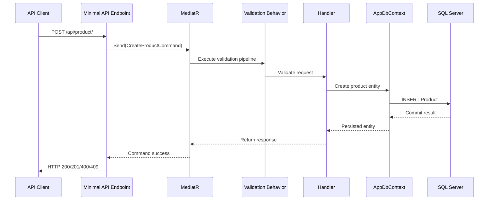

# Backend Architecture: .NET Minimal API, CQRS, and EF Core

## 1. Executive Summary

This solution is a small .NET 10 backend starter organized around clean architecture and vertical slices. The codebase currently focuses on the Products feature, but the overall structure is intended to scale into a broader domain-driven backend.

The architecture uses:

- ASP.NET Core Minimal APIs in the API project
- MediatR for commands and queries in the Application project
- FluentValidation for request validation via a shared pipeline behavior
- EF Core with SQL Server in the Infrastructure project
- A clear separation between API concerns, business logic, and persistence

The current workspace is intentionally lightweight and example-oriented rather than enterprise-heavy. The important architectural pattern is the feature-slice workflow: API endpoint -> MediatR request -> application handler -> EF Core context -> domain entity.

## 2. Solution Structure

The repository is organized into a few clear layers:

| Project/folder | Responsibility |
|---|---|
| [apps/api/DotnetApiStarter.Api](../../apps/api/DotnetApiStarter.Api) | HTTP endpoint composition, DI setup, middleware, response envelopes |
| [core/DotnetApiStarter.Application](../../core/DotnetApiStarter.Application) | MediatR handlers, validation, application logic, feature slices |
| [core/DotnetApiStarter.Domain](../../core/DotnetApiStarter.Domain) | Entities and shared domain abstractions |
| [core/DotnetApiStarter.Infrastructure](../../core/DotnetApiStarter.Infrastructure) | EF Core configuration, persistence implementation, migrations |

## 3. Architectural Rules

### 3.1 Flow: API → Application → Domain

The project follows a strict dependency direction:

- API depends on Application and Infrastructure
- Application depends on Domain and abstractions
- Domain does not depend on API or Infrastructure
- Infrastructure implements Application abstractions such as `IApplicationDbContext`

Do not introduce dependencies that violate this layering.

### 3.2 Keep HTTP concerns in the API layer

HTTP-specific behavior belongs in the API project:

- endpoint registration
- route groups and URL conventions
- response formatting via `ResponseResult<T>`
- exception-to-HTTP mapping in [apps/api/DotnetApiStarter.Api/Middleware/GlobalExceptionHandler.cs](../../apps/api/DotnetApiStarter.Api/Middleware/GlobalExceptionHandler.cs)

The Application and Domain layers should not know about ASP.NET Core types or HTTP contracts.

### 3.3 Keep business logic in the Application and Domain layers

Use cases should live in feature slices under the Application project. Handlers hold the orchestration and persistence logic, while domain entities keep state and invariants.

Do not put endpoint-specific logic in the domain layer, and do not put database implementation decisions in the application layer beyond interacting through abstractions.

### 3.4 Extend existing patterns instead of inventing parallel conventions

The repository already has a working pattern for feature code and Minimal API composition. Prefer that pattern over creating new abstractions or alternate route conventions.

## 4. Feature-Slice Pattern to Reuse

### 4.1 Products feature

The current workspace demonstrates the preferred structure in the Products feature:

- API routes: [apps/api/DotnetApiStarter.Api/Features/Products/ProductEndpoints.cs](../../apps/api/DotnetApiStarter.Api/Features/Products/ProductEndpoints.cs)
- Commands: [core/DotnetApiStarter.Application/Features/Products/Commands](../../core/DotnetApiStarter.Application/Features/Products/Commands)
- Queries: [core/DotnetApiStarter.Application/Features/Products/Queries](../../core/DotnetApiStarter.Application/Features/Products/Queries)
- Domain entity: [core/DotnetApiStarter.Domain/Entities/Product.cs](../../core/DotnetApiStarter.Domain/Entities/Product.cs)

A feature slice should keep together the request model, validator, handler, result DTO, and endpoint registration that belong to that capability.

### 4.2 CQRS via MediatR

The API delegates to `ISender` and the Application layer uses MediatR request/handler pairs.

Key characteristics:

- commands for create, update, delete, and state-changing actions
- queries for reads and result projections
- validation pipeline before business logic executes

Representative examples in the workspace:

- [core/DotnetApiStarter.Application/Features/Products/Commands/CreateProduct/CreateProductCommand.cs](../../core/DotnetApiStarter.Application/Features/Products/Commands/CreateProduct/CreateProductCommand.cs)
- [core/DotnetApiStarter.Application/Features/Products/Commands/CreateProduct/CreateProductHandler.cs](../../core/DotnetApiStarter.Application/Features/Products/Commands/CreateProduct/CreateProductHandler.cs)
- [core/DotnetApiStarter.Application/Features/Products/Queries/GetProducts/GetProductsQuery.cs](../../core/DotnetApiStarter.Application/Features/Products/Queries/GetProducts/GetProductsQuery.cs)
- [core/DotnetApiStarter.Application/Features/Products/Queries/GetProducts/GetProductsHandler.cs](../../core/DotnetApiStarter.Application/Features/Products/Queries/GetProducts/GetProductsHandler.cs)

### 4.3 Sequence Diagram

## 5. Current Implementation Patterns

### 5.1 API composition

The API bootstraps dependencies in [apps/api/DotnetApiStarter.Api/Program.cs](../../apps/api/DotnetApiStarter.Api/Program.cs):

- `AddInfrastructure(builder.Configuration)` registers SQL Server and EF Core
- `AddApplication()` registers MediatR and validators
- `AddExceptionHandler<GlobalExceptionHandler>()` wires the centralized error handling
- `MapProductEndpoints()` registers the feature route group

This is the standard pattern to follow when adding new feature areas.

### 5.2 Validation pipeline

The application contains a centralized MediatR validation behavior at [core/DotnetApiStarter.Application/Common/Behaviors/ValidationBehavior.cs](../../core/DotnetApiStarter.Application/Common/Behaviors/ValidationBehavior.cs).

The behavior:

- resolves validators for the request type
- runs them asynchronously
- throws `FluentValidation.ValidationException` on failure
- stops invalid requests before business logic executes

This is the preferred validation pattern for new commands and queries.

### 5.3 EF Core persistence

The infrastructure layer is responsible for persistence setup and mapping:

- [core/DotnetApiStarter.Infrastructure/DependencyInjection.cs](../../core/DotnetApiStarter.Infrastructure/DependencyInjection.cs)
- [core/DotnetApiStarter.Infrastructure/Persistence/AppDbContext.cs](../../core/DotnetApiStarter.Infrastructure/Persistence/AppDbContext.cs)
- [core/DotnetApiStarter.Infrastructure/Persistence/Configurations/ProductConfiguration.cs](../../core/DotnetApiStarter.Infrastructure/Persistence/Configurations/ProductConfiguration.cs)

Current conventions from the workspace include:

- `AppDbContext` implements `IApplicationDbContext`
- `ApplyConfigurationsFromAssembly()` is used to register entity configurations
- entity configuration is declared in Fluent API instead of attributes
- SQL Server is configured through the `DefaultConnection` connection string

Use `AsNoTracking()` for read-only queries.

### 5.4 Error handling contract

The API uses a global exception handler and structured result wrapper.

Relevant files:

- [apps/api/DotnetApiStarter.Api/Middleware/GlobalExceptionHandler.cs](../../apps/api/DotnetApiStarter.Api/Middleware/GlobalExceptionHandler.cs)
- [apps/api/DotnetApiStarter.Api/Common/Responses/ResponseResult.cs](../../apps/api/DotnetApiStarter.Api/Common/Responses/ResponseResult.cs)
- [apps/api/DotnetApiStarter.Api/Common/Responses/ResponseResultExtensions.cs](../../apps/api/DotnetApiStarter.Api/Common/Responses/ResponseResultExtensions.cs)

The handler maps:

- validation failures -> 400
- not found -> 404
- conflicts -> 409
- unhandled exceptions -> 500

Keep exception-to-HTTP mapping centralized here instead of scattering it across endpoints.

## 6. Patterns to Follow When Extending the Codebase

### 6.1 Adding a new feature

When implementing a new business capability, follow the same vertical-slice pattern used for Products:

1. Add endpoint group under [apps/api/DotnetApiStarter.Api/Features](../../apps/api/DotnetApiStarter.Api/Features)
2. Add MediatR request/handler files under [core/DotnetApiStarter.Application/Features](../../core/DotnetApiStarter.Application/Features)
3. Add validators alongside commands and queries when request validation is needed
4. Add or update EF Core entity configuration in [core/DotnetApiStarter.Infrastructure/Persistence/Configurations](../../core/DotnetApiStarter.Infrastructure/Persistence/Configurations)
5. Update migrations when the schema changes

### 6.2 Naming and structure conventions

Preserve the existing conventions used in the workspace:

- nullable reference types enabled
- implicit usings enabled
- PascalCase public types and members
- constructor injection for dependencies
- async EF Core APIs
- repository and feature names in the same domain vocabulary

### 6.3 Use the existing response pattern

Endpoints should return `ResponseResult<T>` rather than raw POCOs or ad hoc payload shapes. This keeps the API contract consistent and fits the current backend pattern.

## 7. Current Conventions and Gaps

### 7.1 Existing conventions

- SQL Server is the established persistence integration
- Product CRUD is the implemented sample feature
- Minimal API routes are grouped by feature
- MediatR and FluentValidation are the primary application patterns
- Domain entities are kept free of infrastructure concerns

### 7.2 Current gaps to be aware of

- No authentication or authorization configuration is present
- No test project exists in the current workspace
- SQL Server is the only identified data provider integration
- Database migration execution is not configured in startup by default

Do not assume routes are protected. If a feature needs auth later, add it intentionally and centrally.

## 8. Architectural Guidance

This solution is intentionally simple, but the structure is sound for growth. When adding new features:

- keep the API thin and route-focused
- keep domain rules in Domain and Application boundaries
- follow the existing feature-slice pattern
- prefer MediatR and `ISender` over direct service calls from endpoints
- keep EF Core configuration and persistence concerns in Infrastructure

The project should remain a clean .NET backend without introducing parallel architectures, ad hoc service locator patterns, or direct database access from the API layer.

## 9. Summary

The current workspace demonstrates a healthy, minimal clean-architecture backend with a feature-based Product slice. The strongest patterns to follow are:

- Minimal API route groups
- MediatR commands and queries
- centralized validation
- EF Core configuration outside the domain
- explicit response/result envelopes and global exception mapping

Use these patterns as the baseline for all future backend work in this repository.