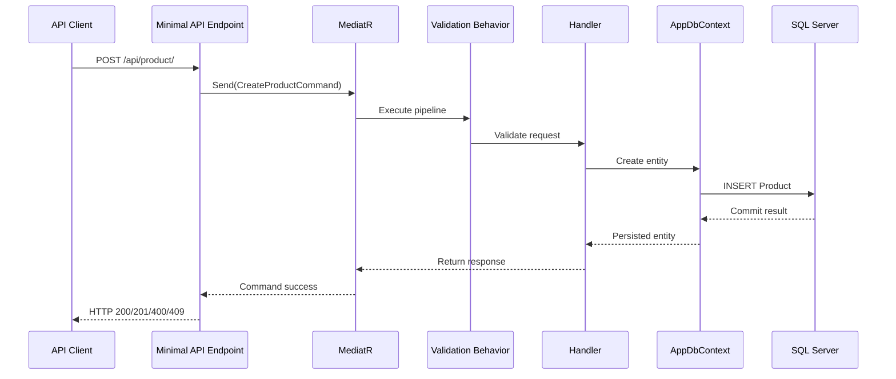

# Backend Architecture: .NET Minimal API, CQRS, and EF Core

## 1. Executive Summary

This solution is a sales and inventory management platform built around a backend-first clean architecture approach. The backend is organized as a .NET 10 application centered on ASP.NET Core Minimal APIs, MediatR-driven request handling, FluentValidation validation, and EF Core persistence against SQL Server.

The project is intentionally structured around separation of concerns:

- API project: HTTP routing, request shaping, and endpoint composition
- Application project: business logic, use cases, validation, and orchestration
- Domain project: aggregates, entities, and domain rules
- Infrastructure project: EF Core configuration, persistence, and migrations

The current architecture already demonstrates a solid foundation for a feature-oriented, CQRS-style backend and is well positioned to evolve into a more mature enterprise system.

## 2. Architectural Principles

### 2.1 Feature-Based / Vertical Slice Design

The most important structural pattern in the backend is feature-first design. The product area is organized by business capability rather than by generic technical layers.

Examples include:

- API endpoint registration: [apps/api/CopylaneSalesInventory.API/Features/Products/ProductEndpoints.cs](apps/api/CopylaneSalesInventory.API/Features/Products/ProductEndpoints.cs)
- Commands and handlers: [src/Application/Features/Products/Command](src/Application/Features/Products/Command)
- Queries and handlers: [src/Application/Features/Products/Queries](src/Application/Features/Products/Queries)
- Shared validation behavior: [src/Application/Common/Behaviors/ValidationBehavior.cs](src/Application/Common/Behaviors/ValidationBehavior.cs)

This pattern keeps the business capability cohesive. A feature slice owns the request model, validation rules, command/query handlers, and persistence interactions without spreading those responsibilities across multiple unrelated layers.

### 2.2 CQRS via MediatR

The backend uses MediatR as the mediator boundary between the API layer and the application layer.

Core characteristics:

- requests are typed objects implementing `IRequest<TResponse>`
- handlers implement `IRequestHandler<TRequest, TResponse>`
- endpoints delegate to `ISender` instead of directly invoking services

Representative examples:

- create command: [src/Application/Features/Products/Command/CreateProduct/CreateProductCommand.cs](src/Application/Features/Products/Command/CreateProduct/CreateProductCommand.cs)
- create handler: [src/Application/Features/Products/Command/CreateProduct/CreateProductHandler.cs](src/Application/Features/Products/Command/CreateProduct/CreateProductHandler.cs)
- product query: [src/Application/Features/Products/Queries/GetProducts/GetProductsQuery.cs](src/Application/Features/Products/Queries/GetProducts/GetProductsQuery.cs)
- query handler: [src/Application/Features/Products/Queries/GetProducts/GetProductsHandler.cs](src/Application/Features/Products/Queries/GetProducts/GetProductsHandler.cs)

This gives the backend a natural CQRS split:

- commands for create, update, delete, or state-changing actions
- queries for reading and projecting data

This approach scales well as the application adds more business areas like warehouse operations, stock adjustments, and movement history.

## 3. Solution Structure

The backend is separated into a few clear layers:

### 3.1 API Layer

The entry point for HTTP traffic is the API project located under [apps/api/CopylaneSalesInventory.API](apps/api/CopylaneSalesInventory.API).

This layer is responsible for:

- endpoint registration
- minimal API route mapping
- request validation and response formatting
- dependency injection setup
- middleware and exception handling

Primary files include:

- [apps/api/CopylaneSalesInventory.API/Program.cs](apps/api/CopylaneSalesInventory.API/Program.cs)
- [apps/api/CopylaneSalesInventory.API/Features/Products/ProductEndpoints.cs](apps/api/CopylaneSalesInventory.API/Features/Products/ProductEndpoints.cs)
- [apps/api/CopylaneSalesInventory.API/Middleware/GlobalExceptionHandler.cs](apps/api/CopylaneSalesInventory.API/Middleware/GlobalExceptionHandler.cs)

### 3.2 Application Layer

The application layer contains business logic implementations and orchestration behavior.

Responsibilities include:

- command and query handlers
- domain validation rules
- use-case coordination
- transaction-aware application behavior

This is the layer that translates business intent into persistence operations while preserving domain boundaries.

### 3.3 Domain Layer

The domain model is defined in [src/Domain](src/Domain) and contains the core entities and business concepts such as:

- product
- warehouse
- stock
- inventory
- inventory details
- category

Key files include:

- [src/Domain/Entities/Product.cs](src/Domain/Entities/Product.cs)
- [src/Domain/Entities/Warehouse.cs](src/Domain/Entities/Warehouse.cs)
- [src/Domain/Entities/Stock.cs](src/Domain/Entities/Stock.cs)
- [src/Domain/Entities/Inventory.cs](src/Domain/Entities/Inventory.cs)

This layer should remain free from infrastructure concerns and should express business concepts, not database details.

### 3.4 Infrastructure Layer

The infrastructure layer is responsible for persistence and integration concerns.

Key responsibilities:

- EF Core setup
- DbContext registration
- entity configuration
- migration management
- repository or data access abstractions

Important implementation points include:

- [src/Infrastructure/DependencyInjection.cs](src/Infrastructure/DependencyInjection.cs)
- [src/Infrastructure/Persistence/AppDbContext.cs](src/Infrastructure/Persistence/AppDbContext.cs)
- [src/Infrastructure/Migrations](src/Infrastructure/Migrations)

## 4. Backend Runtime Flow

### 4.1 Minimal API Request Lifecycle

A typical request follows this path:

1. HTTP request reaches the endpoint in the API project.
2. The endpoint maps the request to a MediatR command or query.
3. `ISender` dispatches the message to the relevant handler.
4. Validation behavior runs before business logic executes.
5. Handler interacts with the application/domain layer and EF Core context.
6. Data is persisted to SQL Server through the configured DbContext.
7. Result is mapped back to an HTTP response.

### 4.2 Example: Create Product

The product creation flow is a good example of the project’s current backend architecture:

1. A client calls `POST /api/product/`.
2. The endpoint deserializes the request and sends a `CreateProductCommand`.
3. MediatR resolves the matching command handler.
4. FluentValidation checks the request before the business logic runs.
5. The handler validates business rules and creates the entity.
6. EF Core tracks the new entity and writes it to SQL Server.
7. The endpoint returns the result or a problem response if validation or business rules fail.

### 4.3 Sequence Diagram

## 5. Persistence and Data Access

### 5.1 EF Core Configuration

The persistence layer uses EF Core with Fluent API configuration instead of attribute-based mapping. This is a strong architectural choice because it keeps persistence rules separate from domain definitions.

Key configuration patterns include:

- `DbSet<T>` exposure on `AppDbContext`
- `ApplyConfigurationsFromAssembly()` to load all entity configurations
- explicit table naming and schema mapping
- unique constraints and field constraints
- query filters for soft-deletion patterns where applicable

Representative configuration files include:

- [src/Infrastructure/Persistence/Configurations/ProductConfiguration.cs](src/Infrastructure/Persistence/Configurations/ProductConfiguration.cs)
- [src/Infrastructure/Persistence/Configurations/WarehouseConfiguration.cs](src/Infrastructure/Persistence/Configurations/WarehouseConfiguration.cs)
- [src/Infrastructure/Persistence/Configurations/InventoryConfiguration.cs](src/Infrastructure/Persistence/Configurations/InventoryConfiguration.cs)

This separation is valuable because it reduces coupling between domain code and the database provider.

### 5.2 Migrations

The project contains EF Core migrations under [src/Infrastructure/Migrations](src/Infrastructure/Migrations), including:

- `InitialCreate`
- `AddWarehouse`
- `AddStock`
- `AddInventory`
- `AddInventoryDetail`

This reflects a conventional schema-evolution workflow. The migration history is tracked and can be used to move the database forward in a controlled way.

### 5.3 Improvement Opportunity

An important operational gap is that the project does not appear to apply migrations automatically during startup with `Database.Migrate()`. In production-ready deployments, this should be considered a standard requirement so schema drift is minimized and database changes remain predictable.

## 6. Cross-Cutting Backend Concerns

### 6.1 Validation Pipeline

The project includes a validation pipeline behavior in [src/Application/Common/Behaviors/ValidationBehavior.cs](src/Application/Common/Behaviors/ValidationBehavior.cs).

This is a strong CQRS pattern because it centralizes validation and keeps endpoint code and handlers clean. The validation behavior ensures that requests are checked consistently before the business logic runs.

This pattern is also a natural place for future behavior extensions such as:

- logging
- audit trail
- performance capture
- caching
- transactions

### 6.2 Global Error Handling

The API includes a global exception handler at [apps/api/CopylaneSalesInventory.API/Middleware/GlobalExceptionHandler.cs](apps/api/CopylaneSalesInventory.API/Middleware/GlobalExceptionHandler.cs).

It maps known exceptions to a structured error model, including:

- validation errors -> 400
- not-found -> 404
- conflicts -> 409
- unhandled exceptions -> 500

This is an important reliability layer because it keeps failure handling consistent and avoids leaking raw exceptions to clients.

### 6.3 Authentication and Authorization

At the current stage, the repository does not show an implemented auth model. There is no evidence of:

- JWT bearer configuration
- ASP.NET Core Identity integration
- policy-based authorization
- role-based access rules

For a sales and inventory platform, this is a significant architectural gap. As the system matures, authentication and authorization should become first-class backend concerns rather than later additions.

## 7. Backend Strengths

The current backend already has several strong characteristics:

- clean separation of concerns across API, application, domain, and infrastructure
- feature-oriented vertical-slice structure
- MediatR-based CQRS separation
- centralized validation and consistent exception handling
- EF Core configuration kept outside the domain model
- migration-based database evolution strategy

These are all hallmarks of a healthy .NET architecture and provide a strong base for continued scaling.

## 8. Current Risks and Gaps

1. Authentication/authorization is not yet implemented.
   - This is essential for secure operations in a business system.

2. Startup database migration execution is not clearly present.
   - This should be automated for safer deployments.

3. Transaction boundaries may need to be formalized.
   - Multi-step inventory actions may require explicit transaction management.

4. The feature structure is still narrow.
   - The product feature is well modeled, but the backend should expand similarly for warehouses, stock movements, inventory adjustments, and reporting.

5. Query optimization should be planned as data volume grows.
   - Pagination, filtering, indexes, and read-model projections will become increasingly important.

## 9. Recommended Backend Refactoring Path

1. Standardize the vertical-slice pattern across all domains.
   - Each feature should own its own endpoints, commands, queries, validators, and handlers.

2. Add a proper auth strategy.
   - Use JWT bearer auth or a secure cookie-based flow depending on deployment needs.

3. Add startup migration execution.
   - Ensure the database schema is always kept in sync with the model.

4. Add transactional behaviors for multi-step writes.
   - Especially for stock movement, inventory adjustments, and cross-warehouse operations.

5. Expand read models and query optimization.
   - Use `AsNoTracking()`, projection patterns, pagination, and filtering thoughtfully.

6. Define a consistent API response contract.
   - This should remain predictable across all endpoints and feature areas.

## 10. Architectural Conclusion

The backend architecture is already moving in the right direction. It has a clear separation between API, application, domain, and infrastructure concerns, and it uses modern patterns such as Minimal APIs, MediatR, validation behaviors, and EF Core.

The most significant strategic opportunity is to mature the backend beyond the initial product feature by strengthening cross-cutting concerns such as authentication, transaction management, and production-grade database lifecycle automation.

Overall, the solution shows a healthy CQRS-oriented .NET architecture with room for growth into a robust enterprise inventory backend.